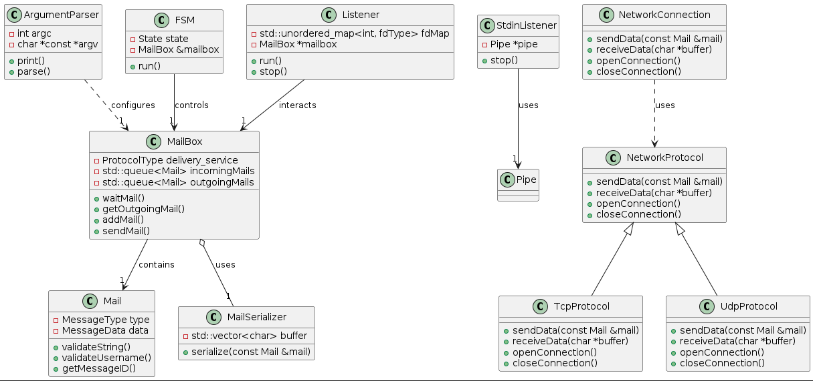
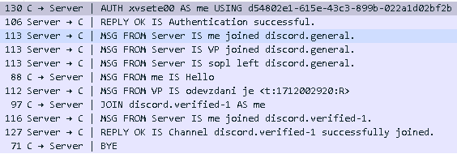

# IPK projekt 1

## Obsah

-   [Theory](#theory)
    -   [Networking Fundamentals](#networking-fundamentals)
    -   [Multi-threading and Concurrency](#multi-threading-and-concurrency)
    -   [Event-Driven Programming](#event-driven-programming)
    -   [State Management](#state-management)
    -   [Inter-process Communication (IPC)](#inter-process-communication-ipc)
    -   [Serialization](#serialization)
-   [Implementation](#implementation)
    -   [`Mail`](#mail)
    -   [`MailBox`](#mailbox)
    -   [`MailSerializer`](#mailserializer)
    -   [`ArgumentParser`](#argumentparser)
    -   [`FSM (Finite State Machine)`](#fsm-finite-state-machine)
    -   [`Listener`](#listener)
    -   [`StdinListener`](#stdinlistener)
    -   [`NetworkProtocol`](#networkprotocol)
    -   [`TcpProtocol`](#tcpprotocol)
    -   [`UdpProtocol`](#udpprotocol)
    -   [`NetworkConnection`](#networkconnection)
    -   [`Pipe`](#pipe)
    -   [`PipeManager`](#pipemanager)
    -   [Use of Threading](#use-of-threading)
        -   [`Listener` and `StdinListener` Threads](#listener-and-stdinlistener-threads)
    -   [Use of Pipes](#use-of-pipes)
        -   [Communicating between `StdinListener` and `Listener`](#communicating-between-stdinlistener-and-listener)
        -   [Signaling New Messages or Events](#signaling-new-messages-or-events)
        -   [Integration with `epoll` for Efficient Event Handling](#integration-with-epoll-for-efficient-event-handling)
-   [Tests](#tests)
    -   [System Specifications](#system-specifications)
        -   [Processor](#processor)
        -   [General Info](#general-info)
        -   [Features](#features)
        -   [Vulnerabilities](#vulnerabilities)
        -   [Performance](#performance)
        -   [Architecture](#architecture)
-   [Bibliography](#bibliography)

## Theory

The theoretical foundation of our chat-room client, utilizing the IPK24-chat protocol over TCP and UDP, is built on key principles from established texts in computer networking and concurrent programming. Insights from "Computer Networking: A Top-Down Approach" by Kurose & Ross and "UNIX Network Programming" by Stevens provide a deep dive into networking fundamentals and socket programming. Concurrent programming concepts critical to our application's design are drawn from "Programming with POSIX Threads" by Butenhof and system-level insights from "Linux System Programming" by Love. These sources collectively inform the architecture and functionality of our client application.

### Networking Fundamentals

-   **TCP vs. UDP**: The IPK24-chat protocol supports both TCP and UDP. TCP provides reliable, ordered, and error-checked delivery of a stream of bytes between applications running on hosts communicating via an IP network. In contrast, UDP is simpler, connectionless, and provides programs with a direct way to send and receive datagrams over an IP network, trading reliability for speed and simplicity, suitable for scenarios where speed is critical and occasional data loss is acceptable.
-   **Network Communication**: The application utilizes socket programming to establish connections, send, and receive messages over the network. It dynamically selects TCP or UDP based on configuration, adapting to requirements for reliability or speed.

### Multi-threading and Concurrency

-   **Thread Usage**: Separate threads handle user input and network events, allowing the application to remain responsive. The `StdinListener` thread monitors user inputs, and the `Listener` thread handles network messages and signals, with `epoll` for efficient event multiplexing.
-   **Thread Safety and Synchronization**: The application ensures thread safety through careful management of shared resources. Synchronization primitives, such as mutexes and condition variables, protect shared data and coordinate thread execution.

### Event-Driven Programming

-   **`epoll` for Event Multiplexing**: The application uses `epoll`, a scalable I/O event notification mechanism, to monitor multiple file descriptors to see if I/O is possible on any of them, making the network communication efficient by only acting on active sockets or pipes.
-   **Asynchronous I/O**: This approach allows the application to perform other tasks while waiting for network events or user inputs, significantly improving the user experience in a networked application.

### State Management

-   **Finite State Machine (FSM)**: The application implements an FSM to manage the client's state, enabling clear transitions between different states (e.g., connecting, authenticated, chatting) based on user actions and network events. This method provides a structured approach to handle the complexities of network communication protocols.

### Inter-process Communication (IPC)

-   **Pipes for IPC**: The application uses UNIX pipes to facilitate communication between threads, particularly for notifying the main listener thread about new user inputs or internal events. This mechanism is crucial for coordinating actions and managing the flow of information within the application.

### Serialization

-   **Data Serialization**: For network transmission, the application serializes data into a binary format, enabling efficient communication and adherence to the IPK24-chat protocol requirements. This process is reversible, allowing the application to deserialize incoming data back into usable structures.

## Implementation

#### `Mail`

-   **Purpose**: Represents different types of messages that can be sent and received within the application. It includes utilities for validating message content and encapsulates various message types through a variant type.
-   **Key Functionalities**:
    -   Validation of string fields based on provided patterns.
    -   Encapsulation of message data as a variant of different message types.

#### `MailBox`

-   **Purpose**: Manages incoming and outgoing mails within the application. It acts as a queue for mail items waiting to be processed or sent.
-   **Key Functionalities**:
    -   Addition and retrieval of mail items to/from respective queues.
    -   Notification mechanism for new mail items through a condition variable.
    -   Interaction with `Pipe` for signal notifications.

#### `MailSerializer`

-   **Purpose**: Serializes mail objects into a binary format for transmission over the network. It's designed to support both UDP and TCP protocols.
-   **Key Functionalities**:
    -   Serialization of `Mail` objects into a vector of characters.
    -   Overloaded call operators for different mail message types for serialization purposes.

#### `ArgumentParser`

-   **Purpose**: Parses command-line arguments to configure the application settings, such as network type, IP address, port, etc.
-   **Key Functionalities**:
    -   Parsing of command-line arguments to extract application configuration.
    -   Provision of usage information for the application.

#### `FSM (Finite State Machine)`

-   **Purpose**: Controls the state transitions of the application to manage the flow of operations based on events and received messages.
-   **Key Functionalities**:
    -   Execution of state-dependent logic to handle application workflow.
    -   Interaction with `MailBox` for processing of mail items.

#### `Listener`

-   **Purpose**: Listens for and handles incoming data from various sources, including standard input, network sockets, and pipes. Utilizes `epoll` for efficient event multiplexing.
-   **Key Functionalities**:
    -   Registration and management of file descriptors for `epoll` event loop.
    -   Handling of incoming data based on source (stdin, network, pipe) and dispatching actions accordingly.

#### `StdinListener`

-   **Purpose**: Specifically listens for standard input (stdin) data in a separate thread and communicates with the `Listener` through a `Pipe`.
-   **Key Functionalities**:
    -   Continuous reading of stdin in a non-blocking manner.
    -   Writing of stdin data to a pipe for processing by the `Listener`.

#### `NetworkProtocol`

-   **Purpose**: Abstract base class defining a common interface for network protocols (TCP, UDP) for sending and receiving data.
-   **Key Functionalities**:
    -   Pure virtual methods for opening/closing connections and sending/receiving data, to be implemented by derived classes.

#### `TcpProtocol`

-   **Purpose**: Implements the `NetworkProtocol` interface for TCP communication.
-   **Key Functionalities**:
    -   Establishment of TCP connections and transmission of data over TCP.
    -   Handling of socket creation, connection, and data transmission/reception specifics for TCP.

#### `UdpProtocol`

-   **Purpose**: Implements the `NetworkProtocol` interface for UDP communication.
-   **Key Functionalities**:
    -   Handling of UDP socket creation and data transmission with optional confirmations.
    -   Implementation of retry and timeout mechanisms for UDP transmissions.

#### `NetworkConnection`

-   **Purpose**: Manages network communication using either TCP or UDP protocol. It acts as a wrapper around the `NetworkProtocol` implementations.
-   **Key Functionalities**:
    -   Sending and receiving of serialized `Mail` data over the network.
    -   Dynamic selection and use of either TCP or UDP protocol based on configuration.

#### `Pipe`

-   **Purpose**: Encapsulates UNIX pipe functionality, allowing for inter-process communication, primarily between different components of the application.
-   **Key Functionalities**:
    -   Creation and management of pipe file descriptors.
    -   Non-blocking write and read operations.

#### `PipeManager`

-   **Purpose**: Manages multiple `Pipe` instances within the application, providing an organized way to handle different types of pipes.
-   **Key Functionalities**:
    -   Storage and retrieval of pipes by type.
    -   Facilitation of inter-component communication through pipes.

### Use of Threading

#### `Listener` and `StdinListener` Threads:

-   **Listener Thread**: Handles multiple sources of input asynchronously, including network sockets, standard input (stdin), and internal signals or messages through pipes. This thread uses `epoll` to multiplex and manage these input sources efficiently, allowing the application to react to network events, user inputs, or internal signals without blocking on any single input source.
-   **StdinListener Thread**: Dedicated to continuously monitoring standard input (stdin) in a non-blocking manner. This separation allows the application to process user commands or inputs asynchronously from other network or internal events. Once input is received, it is communicated to the main `Listener` thread for processing, typically through a pipe.

These threads enable the application to maintain responsiveness and efficiency by handling different types of events concurrently, without one blocking the processing of another.

### Use of Pipes

Pipes are used as a communication mechanism between different parts of the application, specifically between threads or to signal state changes or events. Their primary uses in this context include:

#### Communicating between `StdinListener` and `Listener`:

-   **From `StdinListener` to `Listener`**: When the `StdinListener` captures input from the user, it needs to communicate this input to the main `Listener` thread for processing. Pipes are used to send this data, with the `StdinListener` writing to the pipe and the `Listener` monitoring the pipe's file descriptor using `epoll` to read incoming data.

#### Signaling New Messages or Events:

-   **Internal Notification**: Pipes are also utilized to notify the `Listener` thread of new messages to be sent (via the `ToSendPipe`) or to handle internal signals (via the `SignalPipe`). This mechanism allows for efficient intra-process communication, enabling different components to stay informed about relevant events or data without polling.

#### Integration with `epoll` for Efficient Event Handling:

-   By integrating pipes with `epoll`, the system can efficiently manage and respond to a variety of synchronous and asynchronous events. This integration ensures that the application remains responsive and capable of handling simultaneous inputs and tasks.

## Tests

For the chat application supporting both TCP and UDP communication, the Wireshark dissector for the IPK24-chat protocol was employed during testing. The following edge cases were tested to ensure comprehensive coverage of potential real-world anomalies and to validate the robustness of the chat application:

1. **Receiving Non-authentication Messages in 'auth' State**: To check the application's response to protocol deviations.
2. **Absence of 'REPLY' After 'AUTH'**: To validate timeout and retry mechanisms in the authentication process.
3. **Multiple 'AUTH' Messages Sent**: To confirm that the application prevents re-authentication loops.
4. **Multiple 'JOIN' Messages in 'open' State**: To ensure that the client can't join multiple times simultaneously.
5. **Invalid Transition Attempts**: To test the FSM's resilience against incorrect state changes.
6. **Repeated 'ERR' Messages in 'error' State**: To observe the system's behavior under continuous error conditions.
7. **Unsolicited Messages in 'open' State**: To verify how the application handles unexpected message types.
8. **Rapid State Transitions**: To test the FSM's ability to handle quick changes without failure.
9. **Transition to 'end' from Any State**: To ensure clean closure from any point within the FSM.

### System Specifications

#### Processor

-   **Model**: Intel(R) Core(TM) i5-6300HQ CPU @ 2.30GHz
-   **CPU MHz**: 2304.000
-   **Cache Size**: 6144 KB
-   **Cores**: 4

#### General Info

-   **Vendor ID**: GenuineIntel
-   **CPU Family**: 6
-   **Model Number**: 94
-   **Stepping**: 3
-   **Microcode Version**: 0xffffffff

#### Features

-   **Virtualization (Hypervisor)**: Yes
-   **Security Features**: NX, IBRS, IBPB, STIBP
-   **Performance Boosting**: HT (Hyper-Threading), Turbo Boost
-   **Additional Flags**: SSE4_1, SSE4_2, AVX2

#### Vulnerabilities

-   **Bugs**: cpu_meltdown, spectre_v1, spectre_v2, spec_store_bypass, etc.

#### Performance

-   **BogoMIPS**: 4608.00

#### Architecture

-   **Physical Address Sizes**: 39 bits
-   **Virtual Address Sizes**: 48 bits

_Note: This configuration represents one of the CPU cores as seen by the system. All cores have similar configurations._

## Bibliography

-   Kurose, J. F., & Ross, K. W. **Computer Networking: A Top-Down Approach**. [2016]. Pearson.

-   Stevens, W. R. **UNIX Network Programming, Volume 1, Third Edition**. [2003]. Addison-Wesley Professional.

-   Butenhof, D. R. **Programming with POSIX Threads**. [1997].Addison-Wesley.

-   Love, R. **Linux System Programming: Talking Directly to the Kernel and C Library**. [2007]. O'Reilly Media, Inc.
